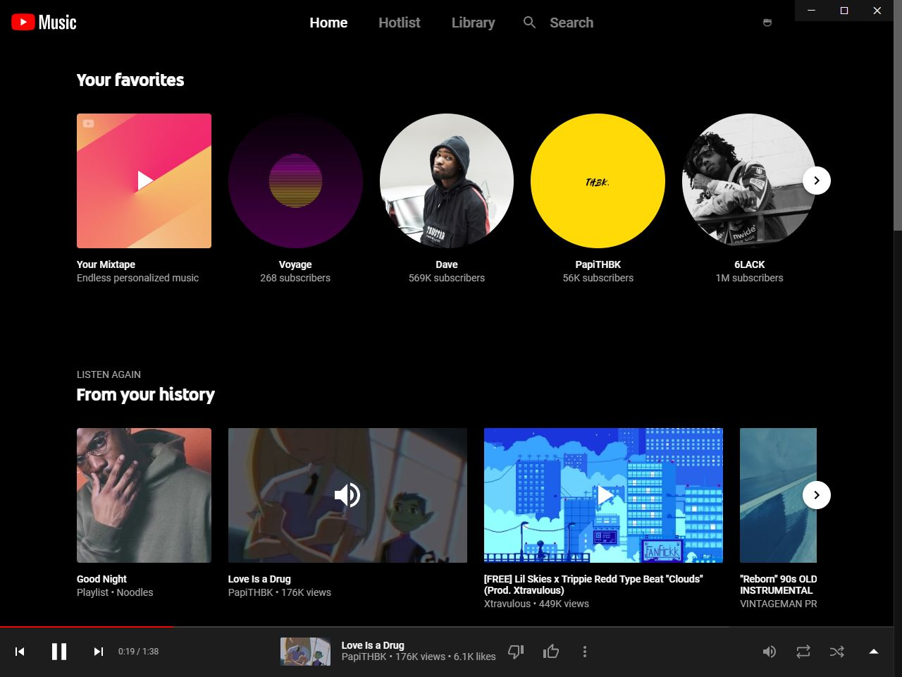

# YouTube Music Desktop

Desktop client for YouTube Music, because YouTube didn't do it.

Includes native platform features like media playback buttons on thumbnails.

Currently only available for [Windows](https://github.com/alex-lushiku/youtube-music-desktop/releases), but have a look at [this](https://ytmusic.app) for MacOS.

## Installation
If you run into any installation problems, try turning off your anti-virus.

## License
[GNU GPLv3](LICENSE)
